<h1 align="center">
   
BUILD A THREE-TIER ARCHITECTURE FOR DEPLOY LAMP STACK APPLICATION ON AWS
</h1>

 Focusing on the application of <b>DevOps</b> tools.

    <b>The language used is</b>
    <a href="README.md">English</a>
    <a href="README.md">Vietnamese</a>

# Workshop Overview 

In this workshop, you will learn about building a three-tier architecture with high availability and fault tolerance to deploy a **LAMP STACK** application on **AWS**. We will leverage various **AWS** services using the **management console**.

# Link Gitpage: 

https://trannhatt.github.io/workshop1-FCJ2024/

# Description

1. Within the **VPC**, there are both public and private subnets distributed across 2 availability zones.
2. An **Internet Gateway** is used to allow communication between instances within the VPC and the Internet.
3. We utilize **2 Availability Zones** to ensure high availability and fault tolerance.
4. Other resources such as **Nat Gateway**, **Bastion Host**, and **Application Load Balancer** reside in **Public Subnets**.
5. Web servers and database servers are placed in **Private Subnets** to protect them.
6. **Nat Gateway** enables instances in private app subnets and private data subnets to access the internet.
7. We employ **MYSQL database** and **EC2 Instances** to host the website.
8. **Application Load Balancer** is used to distribute web traffic across **Auto Scaling Groups** of EC2 instances in multiple AZs.
9. **Auto Scaling Group** ensures the website is highly available, scalable, fault-tolerant, and flexible.
10. **AWS S3** is utilized for storing web application source code, and **IAM Role** is created to grant EC2 permission to download the source code from AWS S3.
11. We will deploy our website on one EC2 instance first, then use this instance to create an **AMI**.
12. Utilize **AWS WAF (Web Application Firewall)** to protect the application, and use **CloudFront** service to enhance performance and reduce latency when users access the website.
13. **Route 53** can be used to register the domain name and create a record set.

## Availability Zone

An **Availability Zone** (AZ) is a subset of data centers within a Region and is defined based on geographical location. Within an AZ, there can be one or more subnets, but a subnet can only reside in a single AZ and cannot span across multiple AZs.

## Subnet

A **Subnet** is a segment of the IP address range that you use when you create an Amazon VPC, providing a direct network segment for AWS resources to operate within it, such as Amazon EC2, Amazon RDS, etc. Subnets are also defined by a CIDR block and must be within the VPC's CIDR.

Subnets are categorized as **Public**, **Private**, or **VPN-only**.

- **Public subnets** have a route table (discussed later) that routes traffic within the subnet to the VPC IGW (also discussed later).
- **Private subnets** lack this route table for routing traffic to the VPC IGW.
- **VPN-only subnets** are those that have a route table routing traffic to the VPG of Amazon VPC (discussed later).

Regardless of the subnet type, the internal IP address range of the subnet is always private (meaning it cannot be directly connected to from outside the Internet).

## Route Table

A **Route Table**, also known as a routing table, provides routing instructions and is assigned to subnets.
For example, when you create a VPC with a 10.10.0.0/16 network class and 2 subnets 10.10.1.0/24,10.10.2.0/24 then each subnets will be assigned 1 default route table by default.
Inside the route table will have route entry **destination**:10.10.0.0/16 **target**:local. This route entry shows that the resources created within the same VPC can connect to each other.

## Internet Gateway

An **Internet Gateway (IGW)** is an Amazon VPC component that enables AWS resources within the VPC, specifically EC2, to communicate with the Internet. The IGW can scale horizontally, ensuring redundancy and high availability. It acts as a target in the Amazon VPC's route table, allowing traffic to be routed out to the Internet by translating the EC2's network address into the assigned Public IP address.

## NAT Gateway

By default, EC2s running in a Private subnet do not have the ability to communicate with the Internet through the **IGW**. Hence the problem arises when that EC2 needs to access the Internet for applying security updates, downloading patches, or updating application software.
Capturing that need, AWS provides 2 methods to allow EC2s inside Private subnets to access the Internet, that is **NAT Instance** and **NAT Gateway**. For ordinary cases, we should use **NAT Gateway** instead of **NAT Instance**. **NAT Gateway** ensures higher availability and higher bandwidth, while requiring less administrative effort than **NAT Instance**.

## Load Balancer

A **Load Balancer** is a tool that can distribute exchanged data traffic to AWS resources (specifically in this lab are **EC2 Instances**) within the **Target Group**.

## Target Group

A **Target Group** is a group of AWS resource components that will receive distributed data traffic transmitted by the **Load Balancer**.

## Amazon CloudFront

**Amazon CloudFront** is a **content delivery network (CDN)** service built to ensure high performance, security for users.

## Amazon RDS

**Amazon RDS** is a managed database service that enables you to automate provisioning, operating, and scaling a relational database on AWS's cloud computing platform.

## AWS WAF (Web Application Firewall)

**AWS WAF (Web Application Firewall)** is a network security service that helps protect your web applications from common web exploits, safeguard important data, and ensure application availability.

# Build a Three-Tier AWS Network VPC

In this section, we will build a Three-Tier AWS Network VPC as follows:

- The **VPC** will be created in 2 availability zones with 1 public subnet and 2 private subnets in each AZ.
- 1 **Internet Gateway** will be used to allow communication between instances within the VPC and the Internet.
- We will utilize 2 **Availability Zones** to ensure high availability and fault tolerance.
- Resources such as Nat Gateway, Bastion Host, and Application Load Balancer will be deployed in **Public subnets**.
- We will place web servers and database servers in the **Private Subnets** to protect them.
- The **Public Route Table** will be associated with the public subnets and route traffic to the Internet through the Internet Gateway.
- The **Main Route Table** will be associated with the private subnets.

## Create and Configure VPC

In this section, we will create a VPC and enable DNS Hostname for that VPC.

### Create VPC

1. In the **AWS console** interface:

   - Click on the search bar and type **`VPC`**
   - Under **Services**, select **VPC**
   

2. In the **VPC** interface:

   - Choose **Your VPCs**
   - Click **Create VPC**
   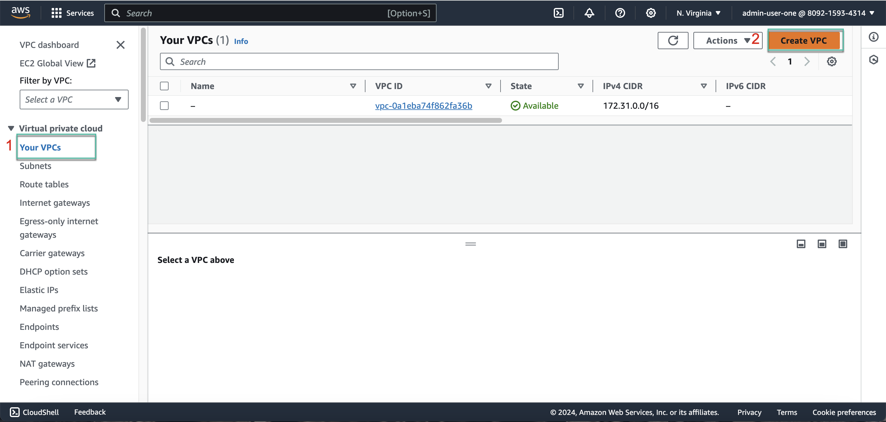

3. In the **Create VPC** interface:

   - Under **Resources to create**, select **VPC only**
   - Under **Name tag - optional**, enter **`lamp-stack-vpc`**
   - Under **IPv4 CIDR block**, choose **IPV4 CIDR manual input**
   - Enter **`10.0.0.0/16`** under **IPv4 CIDR**
   

   Continue,

   - Under **IPv6 CIDR block**, select **No IPv6 CIDR block**
   - Under **Tags**:
     - Enter **`Name`** for **Key**
     - Optionally, enter **`lamp-stack-vpc`** for **Value**
   - Finally, click **Create VPC**
   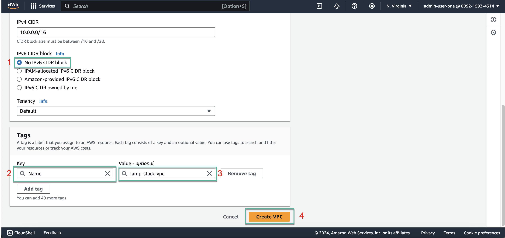

4. You have successfully created the **VPC**
   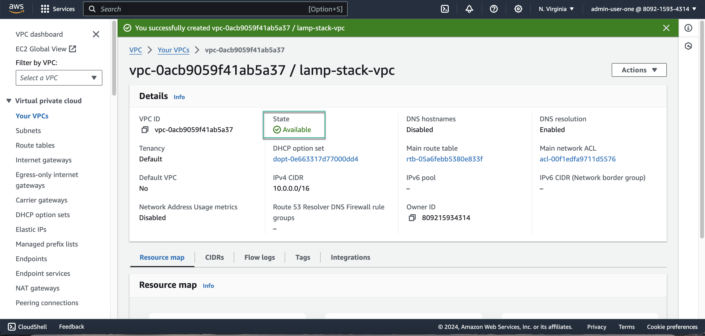
   

### Enable DNS Hostname

1. Navigate back to the **VPC** interface:

   - Select **Your VPCS**
   - Choose the newly created VPC **lamp-stack-vpc**
   - Click on the **Actions** dropdown menu and select **Edit VPC settings**

   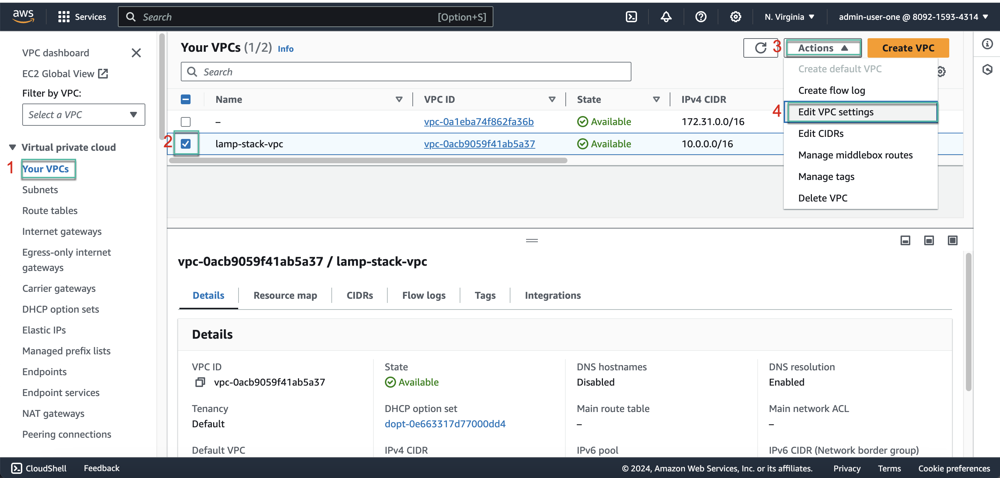

2. In the **Edit VPC settings** interface:

   - Under **DNS settings**, select **Enable DNS resolution** and **Enable DNS hostnames**

   

   Finally,

   - Click **Save**
   
   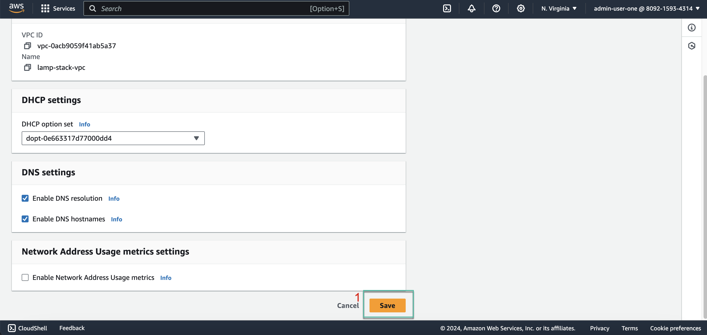

## Create and Attach Internet Gateway (IGW) to VPC

In this section, we will create and attach an Internet Gateway (IGW) to the VPC created in the previous section.

### Create Internet Gateway

1. In the **VPC** interface:

   - Select **Internet gateways**
   - Click on **Create internet gateway**

   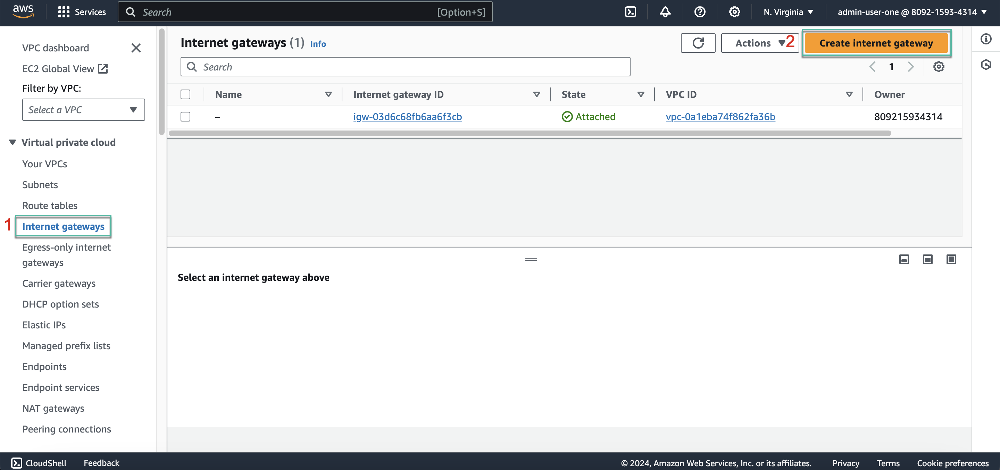

2. In the **Create internet gateway** interface:

   - In the **Name tag** field, enter **`lamp-stack-igw`**
   - In the **Tags** section:
     - Enter **`Name`** for **Key**
     - Optionally, enter **`lamp-stack-igw`** for **Value**
   - Finally, click on **Create internet gateway**

   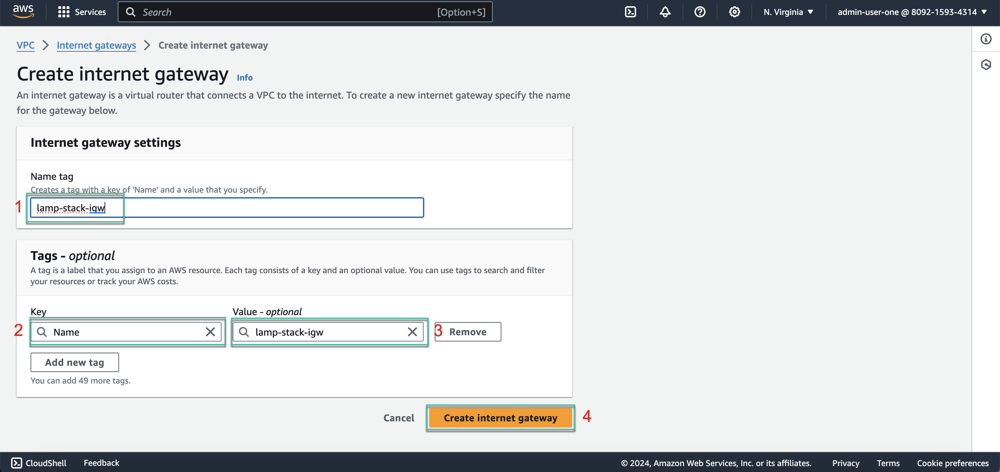

3. We have successfully created the **Internet Gateway**, but it is currently in a **Detached** state as it has not been attached to any VPC yet.

   
   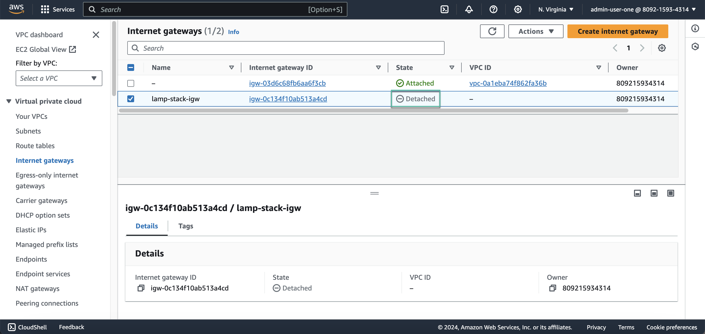

### Attach Internet Gateway to VPC

1. At the newly created IGW **lamp-stack-igw**

   - Click on the **Actions** dropdown menu and select **Attach to VPC**

   

2. In the **Attach to VPC** interface

   - Under **Available VPCs**, select **vpc-Oacb9059f41ab5a37 - lamp-stack-vpc**
   - Click **Attach internet gateway**

   
   
{}
Note: **vpc-Oacb9059f41ab5a37** is your **VPC ID**.
{}

3. We have successfully attached the **Internet Gateway** to the **VPC**. The **State** will now show **Attached**.

   
   

## Create and Configure Subnets

In this section, we will create 6 subnets, including 2 Public Subnets and 4 Private Subnets. Afterward, we will enable IPv4 for the 2 Public Subnets.

### Create 6 Subnets

1. In the **VPC** interface:

   - Select **Subnets**
   - Click on **Create subnet**

   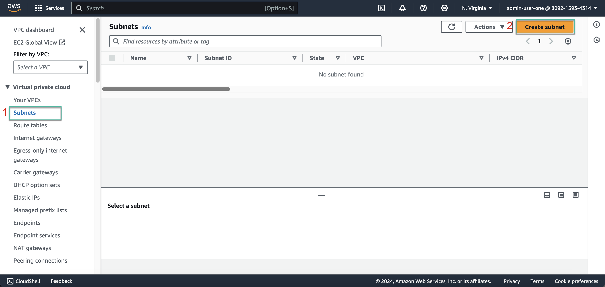

2. In the **Create subnet** interface:

   - Under **VPC ID**, select **vpc-Oacb9059f41ab5a37 (lamp-stack-vpc)**, which is your recently created VPC

   

   Then, under **Subnet settings**, we will create 6 subnets as follows:

   - Create Public Subnet 1:
     - In the **Subnet name** field, enter **`pub-sub-1a`**
     - For **Availability Zone**, select **US East (N. Virginia) / us-east-1a**
     - For **IPv4 subnet CIDR block**, enter **`10.0.1.0/24`**
     - Under **Tags**:
       - Enter **`Name`** for **Key**
       - Optionally, enter **`pub-sub-1a`** for **Value**

   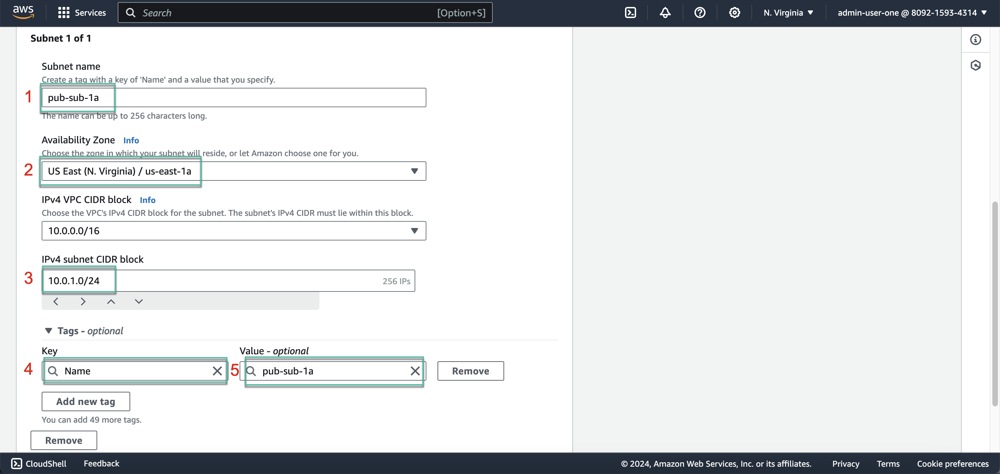

   - Create Public Subnet 2:
     - In the **Subnet name** field, enter **`pub-sub-2b`**
     - For **Availability Zone**, select **US East (N. Virginia) / us-east-1b**
     - For **IPv4 subnet CIDR block**, enter **`10.0.2.0/24`**
     - Under **Tags**:
       - Enter **`Name`** for **Key**
       - Optionally, enter **`pub-sub-2b`** for **Value**

   

   - Create Private Subnet 3:
     - In the **Subnet name** field, enter **`pri-sub-3a`**
     - For **Availability Zone**, select **US East (N. Virginia) / us-east-1a**
     - For **IPv4 subnet CIDR block**, enter **`10.0.3.0/24`**
     - Under **Tags**:
       - Enter **`Name`** for **Key**
       - Optionally, enter **`pri-sub-3a`** for **Value**

   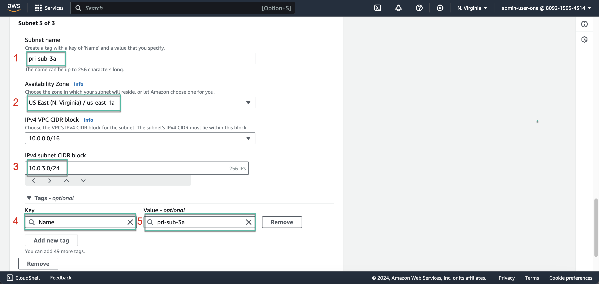

   - Create Private Subnet 4:
     - In the **Subnet name** field, enter **`pri-sub-4b`**
     - For **Availability Zone**, select **US East (N. Virginia) / us-east-1b**
     - For **IPv4 subnet CIDR block**, enter **`10.0.4.0/24`**
     - Under **Tags**:
       - Enter **`Name`** for **Key**
       - Optionally, enter **`pri-sub-4b`** for **Value**

   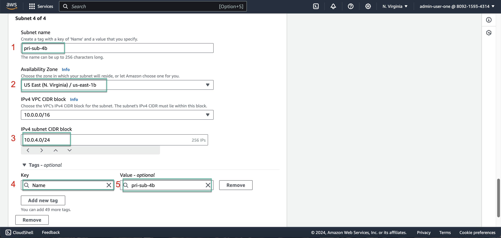

   - Create Private Subnet 5:
     - In the **Subnet name** field, enter **`pri-sub-5a`**
     - For **Availability Zone**, select **US East (N. Virginia) / us-east-1a**
     - For **IPv4 subnet CIDR block**, enter **`10.0.5.0/24`**
     - Under **Tags**:
       - Enter **`Name`** for **Key**
       - Optionally, enter **`pri-sub-5a`** for **Value**

   

   - Create Private Subnet 6:
     - In the **Subnet name** field, enter **`pri-sub-6b`**
     - For **Availability Zone**, select **US East (N. Virginia) / us-east-1b**
     - For **IPv4 subnet CIDR block**, enter **`10.0.6.0/24`**
     - Under **Tags**:
       - Enter **`Name`** for **Key**
       - Optionally, enter **`pri-sub-6b`** for **Value**
      
   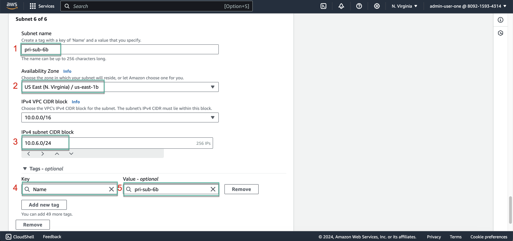

3. The subnets have been successfully created as follows:

   

### Enable IPv4 for 2 Public Subnets

1. In the **Subnets** interface:

   - Select the recently created **pub-sub-1a**
   - Click on the **Actions** dropdown menu and select **Edit subnet settings**

   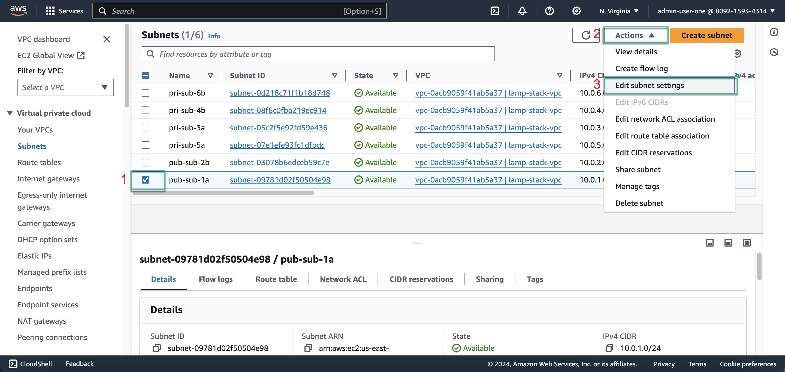

   Then,

   - Under **Auto-assign IP settings**, select **Enable auto-assign public IPv4 address**

   

   - Click **Save** to complete

   

   Similarly, for the other Public Subnet,

   - Select the recently created **pub-sub-2b**
   - Click on the **Actions** dropdown menu and select **Edit subnet settings**

   

   Then,

   - Under **Auto-assign IP settings**, select **Enable auto-assign public IPv4 address**

   

   - Click **Save** to complete

   

CONTINUE,....
